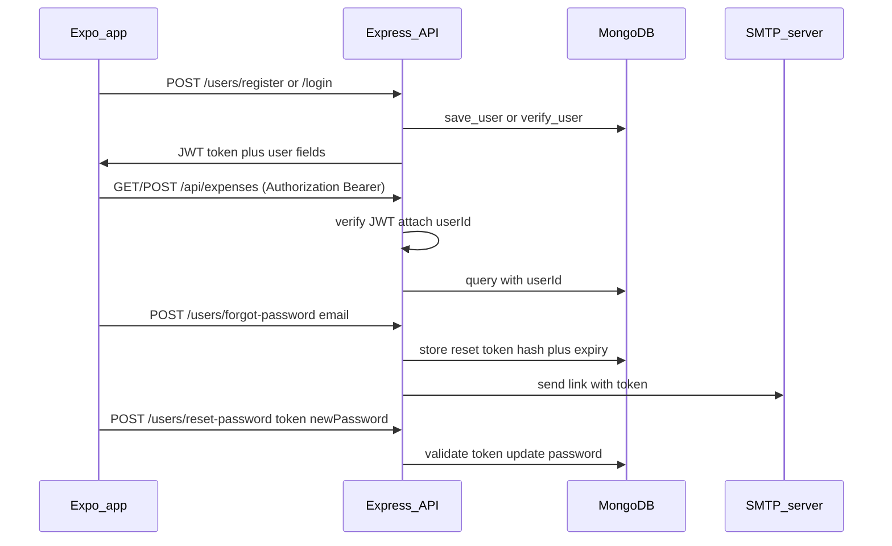

# Auth, forgot password (email), and data isolation

## Scope

- **Item 1 from the analysis**: Align backend and frontend so registration, login, JWT, and protected API access work end-to-end.
- **Forgot password**: User enters **email** on a dedicated screen; backend sends an email with a **reset link**; user sets a **new password** on the reset screen (interpreting “forget email” as the usual **forgot password** flow using email).
- **Email delivery**: **SMTP via Nodemailer** (your choice).

## Architecture (high level)

## Backend ([backend/](backend/))

### Dependencies

Add to [backend/package.json](backend/package.json): `jsonwebtoken`, `bcryptjs`, `nodemailer`, and `@types/jsonwebtoken`, `@types/bcryptjs`, `@types/nodemailer` (dev).

### Env vars (document in code comments or a short note in README if you add one later; user sets `.env`)

- `JWT_SECRET` (required in production)
- `JWT_EXPIRES_IN` (e.g. `7d`)
- `MONGO_URI` (existing)
- `SMTP_HOST`, `SMTP_PORT`, `SMTP_SECURE` (true/false), `SMTP_USER`, `SMTP_PASS`, `MAIL_FROM`
- `PASSWORD_RESET_BASE_URL` — e.g. `https://your-vercel-app.vercel.app` for web, or `khai://` is not ideal for email; **use HTTPS web URL** so the reset page opens in browser (and can deep-link to app if you extend later). Path example: `/auth/reset-password` (frontend route).

### User model (new)

- New file [backend/src/models/User.ts](backend/src/models/User.ts): `name`, `email` (unique), `password` (hash only), `passwordResetToken` (hashed), `passwordResetExpires` (Date), optional `role` (default `user`), timestamps.

### Auth routes and controller

- Implement [backend/src/routes/userRoutes.ts](backend/src/routes/userRoutes.ts):
  - `POST /register` — validate, hash password, issue JWT, return same shape frontend expects (`_id`, `name`, `email`, `role`, `token`).
  - `POST /login` — compare password, issue JWT.
  - `POST /forgot-password` — accept `{ email }`; always respond `200` with a generic message (avoid leaking whether email exists); if user exists, generate random token, store **hash** of token + expiry (~1h), build reset URL: `${PASSWORD_RESET_BASE_URL}/auth/reset-password?token=${rawToken}` (or `token` in query), send email via Nodemailer.
  - `POST /reset-password` — accept `{ token, password }`; hash token, find user, check expiry, set new password, clear reset fields, return success.
- Add [backend/src/controllers/authController.ts](backend/src/controllers/authController.ts) (or split handlers) with these handlers.

### JWT middleware

- Replace stubs in [backend/src/middleware/authMiddleware.ts](backend/src/middleware/authMiddleware.ts): read `Authorization: Bearer <jwt>`, verify with `JWT_SECRET`, attach `req.user = { id, ... }` or fail `401`.

### Mount routes

- In [backend/src/server.ts](backend/src/server.ts): `app.use('/api/users', userRoutes)` (consistent with frontend Axios base `.../api` + `/users/login`).

### Per-user data

- Add `userId: ObjectId` ref to `User` on: [Expense](backend/src/models/Expense.ts), [Task](backend/src/models/Task.ts), [Schedule](backend/src/models/Schedule.ts), [StudySession](backend/src/models/StudySession.ts).
- In each controller under [backend/src/controllers/](backend/src/controllers/): on **create**, set `userId` from `req.user.id`; on **list/get/update/delete**, filter by `userId` (and 404 if document belongs to another user).
- Apply `protect` middleware to [expenseRoutes.ts](backend/src/routes/expenseRoutes.ts), [taskRoutes.ts](backend/src/routes/taskRoutes.ts), [scheduleRoutes.ts](backend/src/routes/scheduleRoutes.ts), [studySessionRoutes.ts](backend/src/routes/studySessionRoutes.ts) (all routes).

**Note:** Existing Mongo documents without `userId` will not appear for any logged-in user. Acceptable for a fresh dev DB; if you have production data, run a one-off migration or manual backfill.

## Frontend ([frontend/](frontend/))

### AuthProvider and API

- Wrap the tree in [frontend/src/app/_layout.tsx](frontend/src/app/_layout.tsx) with `AuthProvider` from [frontend/src/context/AuthContext.tsx](frontend/src/context/AuthContext.tsx).
- Extend `AuthContext`: `forgotPassword(email)`, `resetPassword(token, password)` calling `POST /users/forgot-password` and `POST /users/reset-password` (paths relative to existing `/api` base).
- Keep storing `user` in AsyncStorage and setting `Authorization` on `api` (already done).

### Routing and entry

- Add a root [frontend/src/app/index.tsx](frontend/src/app/index.tsx) that uses `useAuth` + `Redirect` from `expo-router`: if `loading`, show a minimal `ActivityIndicator`; if `user`, redirect to `/(tabs)`; else `href="/auth/login"`.
- Update root `_layout.tsx` `Stack` to include explicit screens for `index`, `(tabs)`, and `auth/*` (or `auth` group) so Expo Router discovers [login](frontend/src/app/auth/login.tsx), [register](frontend/src/auth/register.tsx), and new routes.
- Remove or adjust `unstable_settings.initialRouteName` so it does not force `(tabs)` before auth (the new `index` route should become the entry).

### Screens

- **Login** ([frontend/src/app/auth/login.tsx](frontend/src/app/auth/login.tsx)): email/password fields, submit → `login`, link to Register and **Forgot password**.
- **Register** ([frontend/src/app/auth/register.tsx](frontend/src/app/auth/register.tsx)): replace “no longer available” with name/email/password form → `register`.
- **Forgot password** (new `frontend/src/app/auth/forgot-password.tsx`): email field → `forgotPassword`; success message (“If an account exists, we sent an email”).
- **Reset password** (new `frontend/src/app/auth/reset-password.tsx`): read `token` from `useLocalSearchParams`, new password + confirm → `resetPassword`; on success navigate to login.

**Reset link target**: `PASSWORD_RESET_BASE_URL` should point at your deployed Expo web origin so `/auth/reset-password?token=...` loads the app. [app.json](frontend/app.json) already has `"scheme": "khai"` for native; web URL is the reliable path for email.

### Strict reset utility

- [frontend/src/utils/strictReset.ts](frontend/src/utils/strictReset.ts): add AsyncStorage key `user` (and remove or align `authToken` if unused) so “reset app data” clears auth consistently.

---

## Testing checklist (manual)

- Register → lands on tabs; create expense → only visible when same user.
- Login/logout; second user sees empty data.
- Forgot password → email received (or SMTP error in logs); open link → reset password → login with new password.
- `npm run build` in backend passes.

## Files touched (summary)

| Area     | Files                                                                                                                                                                                         |
| -------- | --------------------------------------------------------------------------------------------------------------------------------------------------------------------------------------------- |
| Backend  | `package.json`, `server.ts`, new `models/User.ts`, `controllers/authController.ts`, `routes/userRoutes.ts`, `middleware/authMiddleware.ts`, four models + four controllers + four route files |
| Frontend | `_layout.tsx`, new `app/index.tsx`, `auth/login.tsx`, `auth/register.tsx`, new `auth/forgot-password.tsx`, `auth/reset-password.tsx`, `AuthContext.tsx`, `strictReset.ts`                     |

